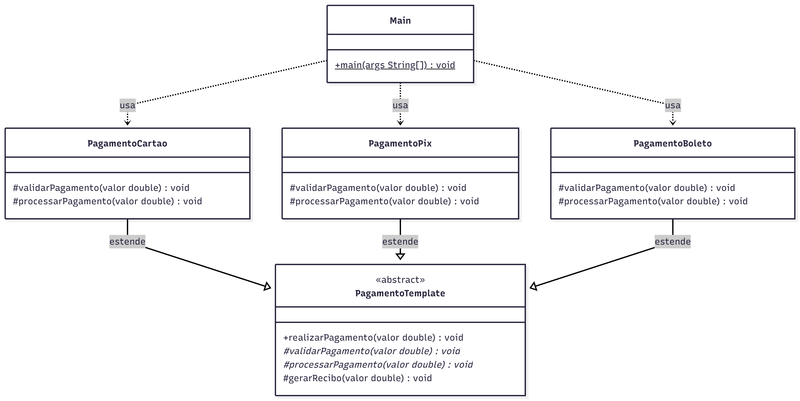

# 💳 Sistema de Pagamentos com Template Method

Projeto desenvolvido em Java com o objetivo de demonstrar a aplicação do **padrão de projeto Template Method** em conjunto com o **princípio da responsabilidade única (SRP)**.

---

## 📌 Sobre o projeto

O sistema simula diferentes formas de pagamento, como cartão, PIX e boleto.

O fluxo de execução do pagamento é definido em uma classe abstrata, garantindo uma sequência fixa de etapas, enquanto as subclasses implementam comportamentos específicos para cada tipo de pagamento.

---

## 🧱 Estrutura do projeto

```id="1h9g0s"
src/
├── main/
│   └── pagamento/
│       ├── PagamentoTemplate.java   // Define o fluxo do algoritmo
│       ├── PagamentoCartao.java     // Implementação para cartão
│       ├── PagamentoPix.java        // Implementação para PIX
│       ├── PagamentoBoleto.java     // Implementação para boleto
│       └── Main.java                // Execução do sistema
│
└── test/
    └── pagamento/
        └── PagamentoTest.java       // Testes unitários
```

---

## 🧠 Padrões e princípios utilizados

### 🔹 Template Method

Define um algoritmo com estrutura fixa, permitindo que subclasses alterem partes específicas do processo.

No projeto:

* O método `realizarPagamento` define o fluxo
* As subclasses implementam validação e processamento
* O recibo é gerado de forma padronizada

---

### 🔹 SRP (Single Responsibility Principle)

Cada classe possui uma única responsabilidade:

* `PagamentoTemplate` → define o fluxo do algoritmo
* `PagamentoCartao` → lógica de pagamento com cartão
* `PagamentoPix` → lógica de pagamento via PIX
* `PagamentoBoleto` → lógica de pagamento via boleto
* `Main` → execução

---

## 📊 Diagrama de Classes



---

## ▶️ Como executar o projeto

### 🔹 Executar a aplicação (Main)

1. Abra o projeto no IntelliJ
2. Navegue até:

   ```
   src/main/pagamento/Main.java
   ```
3. Clique com o botão direito → **Run 'Main.main()'**

---

### 🧪 Executar os testes

1. Navegue até:

   ```
   src/test/pagamento/PagamentoTest.java
   ```
2. Clique com o botão direito → **Run 'Tests'**

> Certifique-se de que o JUnit 5 está configurado no projeto.

---

## ✅ Exemplo de saída

```id="oafh5p"
=== Cartão ===
Validando pagamento no cartão...
Processando pagamento no cartão: R$100.0
Recibo gerado no valor de R$100.0

=== PIX ===
Validando pagamento via PIX...
Processando PIX: R$200.0
Recibo gerado no valor de R$200.0

=== Boleto ===
Validando boleto...
Gerando boleto no valor de R$300.0
Recibo gerado no valor de R$300.0
```
